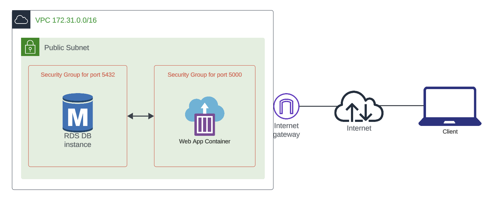

# Overview 

This goal of this activity is to illustrate how to properly setup a simple 3-tier architecture in the cloud. 

# Instructions

## Architecture 



The architecture to be built consists of three layers:

* The client, typically running a web browser and responsible for interfacing with the user.
* A web app, running on a single container instance and responsible for the logic of the application.
* A single database instance for data persistence.

## Part 1: Database

The Terraform configuration in [part1](part1) creates a small PostgreSQL instance in AWS RDS, including a security group to allow remote access. 

To test the database connection, change the working directory to the project's main folder, create a virtual environment, activate it, and install the Python dependencies need for the web app in this activity. 

```
pip3 install -r requirements.txt
```

Update [db.ini](db.ini)'s host with the RDS instance DNS name that was ouput by the Terraform script. Next, run [src/testdb.py](src/testdb.py) and make sure you get "Connection to Postgres database postgres was successful!"

## Part 2: Web App

Export ```FLASK_APP``` having it point to ```src/app```.  Then run the web app locally using ```flask run```. Create a user and some recipes to test the app's functionality. 

## Part 3: Docker Deployment 

Package the application into a Docker image. You will need to create a Dockerfile and then build the image using something like: 

```
docker build --platform linux/amd64 -t act13:v1 .
```

## Part 4: Docker Image Publishing

Upload the Docker image created in Part 3 into AWS ECR (Elastic Container Registry). Use the steps described in Activity 11 (Docker ECR). You can use the same registry named dsml3850.

```
aws ecr get-login-password --region us-west-1 | docker login --username AWS --password-stdin <YOUR-ACCOUNT-ID>.dkr.ecr.us-west-1.amazonaws.com 

docker tag act13:v1 <YOUR-ACCOUNT-ID>.dkr.ecr.us-west-1.amazonaws.com/dsml3850:act13-v1

docker push <YOUR-ACCOUNT-ID>.dkr.ecr.us-west-1.amazonaws.com/dsml3850:act13-v1
```

## Part 5: Tightening the Security

In Part 1, you created a security group to allow access to your PostgreSQL database instance from anywhere. You will now recreate that configuration to only allow access to the database if it is coming from another security group, which will be created for the web app container. Destroy the configuration done in Part 1 and begin working on the one described in this part. 

When you are done recreating the database, create a new version of the Docker image with the new name of the instance. Don't forget to push this new image to ECR. 

## Part 6: ECS Deployment

Use the Docker image uploaded to ECR to deploy the application using AWS ECS. Use the steps described in Activity 12 (ECS). The only difference from Activity 12 is that you are required to create a Task Role so the application is able to access the RDS instance.
