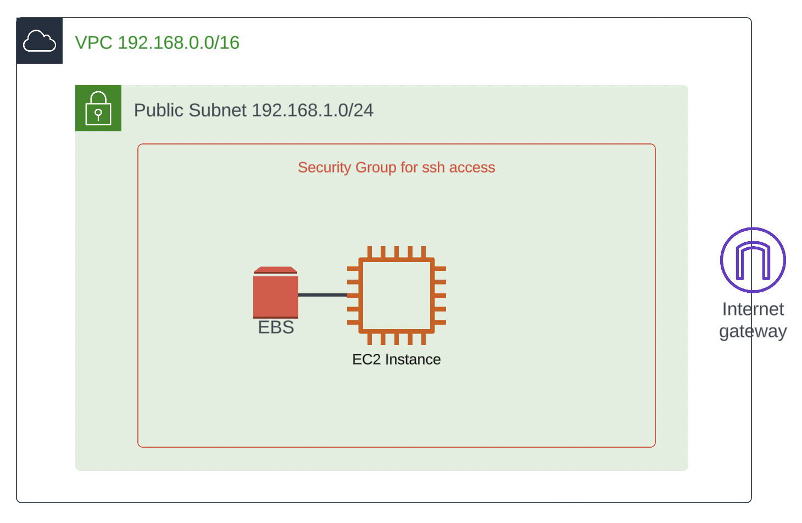

# Overview

In this assignment, you are required to create an EC2 instance and attach an external hard drive to it using the AWS Elastic Block Store (EBS) service. The EC2 instance must be accessible via SSH, and the external hard drive should be automatically mounted when the instance starts.

# Instructions 

The picture below describes the architecture that you are expected to create using terraform / HCL. 



Different than Activity 08 discussed in class, this time you will not break the terraform code into modules, so you can compare both design choices. Make any necessary modifications to variables in [infrastructure/variables.tf](infrastructure/variables.tf). Create and run [infrastructure/main.tf](infrastructure/main.tf). 

[infrastructure/setup.sh](infrastructure/setup.sh) is a "user data" script that automatically mounts the EBS volume to the instance upon initialization

When you are ready, use ```terraform init``` to initialize terraform's working directory. Then, use ```terraform validate``` to check any syntax errors before you build your configuration using ```terraform apply```.  The script should download the SSH private key (file ```key-test-us-west-1-web-ssh.pem```) and display the EC2 instance's public IP address. Use the following to SSH to your instance: 

```
ssh -i key-test-us-west-1-web-ssh.pem ec2-user@<YOUR-IP-ADDRESS>
```

After successfully logging in to your EC2 instance, run the following commands to ensure you can create a file on the attached EBS volume:

```
[ec2-user@ip-... ~]$ sudo su
[root@ip-... ec2-user]# cd /mnt/my-data/
[root@ip-... my-data]# echo "Saving some data in EBS!" > data.txt
[root@ip-... my-data]# cat data.txt
Saving some data in EBS!
```

To submit your work for grading, you need to commit and push your private key, and update the following with your instance's public IP address. 

```
PublicIpAddress: <YOUR-IP-ADDRESS>
```
