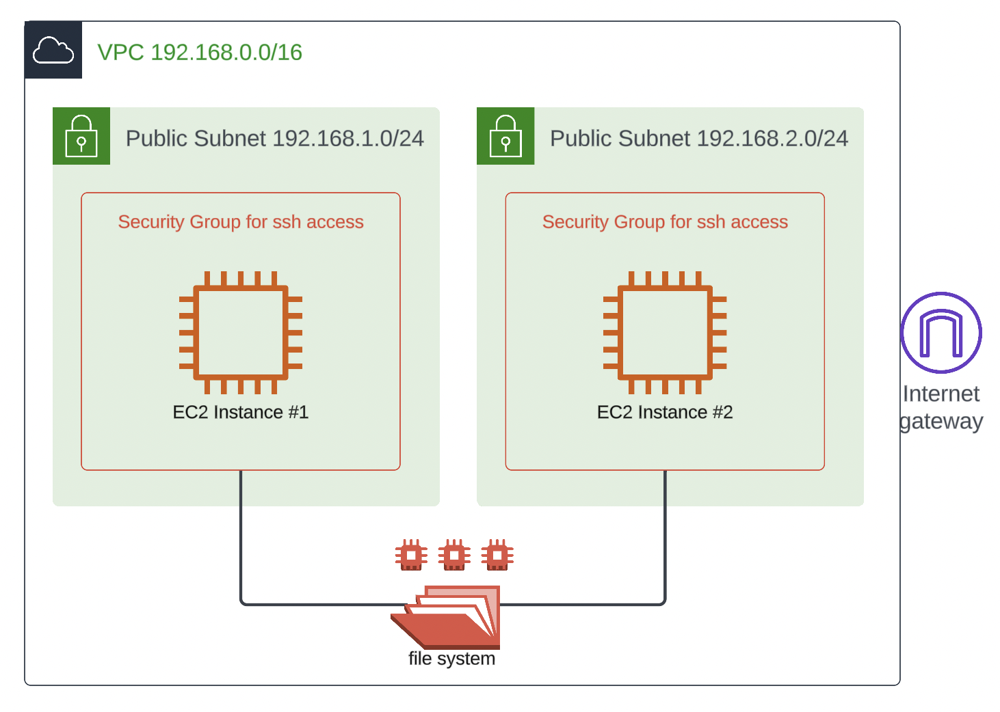

[](https://classroom.github.com/a/Fw7EmkKq)
# Overview 

The goal of this assignment is to have you practice a file-system storage virtualization service (called EFS in AWS). 

# Instructions

## Architecture Diagram



Create and run [infrastructure/main.tf](infrastructure/main.tf), after reviewing the parameters in [infrastructure/variables.tf](infrastructure/variables.tf). 

When creating the EC2 instances, use the user data script [infrastructure/setup.sh](infrastructure/setup.sh). 

## EFS Mounting 

Mounting is going to be done manually after deployment of your infrastructure. SSH to each of your EC2 instances and do the following, replacing ```<EFS-DNS-NAME>``` accordingly. Leave the SSH sessions opened. 

```
sudo su
echo "<EFS-DNS-NAME>:/ /mnt/efs efs defaults,_netdev 0 0" >> /etc/fstab
mount -a
```

## Testing 

On the EC2 instance #1, change the directory to ```/mnt/efs``` and create a file using: 

```
cd /mnt/efs
echo "Hello from EC2 instance #1" > file.txt
```

On the EC2 instance #2, change the directory to ```/mnt/efs``` and see if you can visualize the content of the file created by the other instance using: 

```
cd /mnt/efs
cat file.txt
```

## Submission 

To get full credit on this assignment, you need to copy and paste the sessions of each of the instances below. 

```
EC2 Instance #1 SESSION
```

```
EC2 Instance #2 SESSION
```
