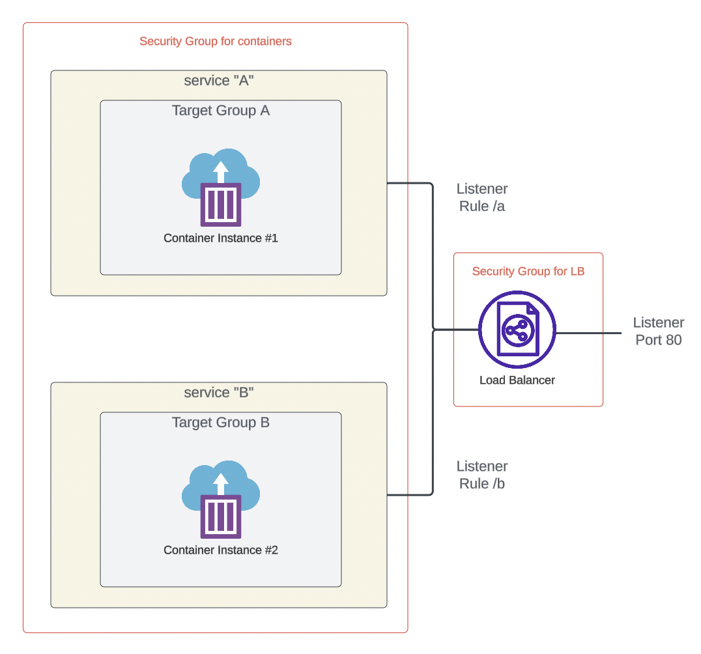

[](https://classroom.github.com/a/qv5X1WHz)
# Overview

The goal of this assignment is to challenge you to design a load balancer that routes traffic based on request patterns.

# Instructions 

## Architecture



As illustrated in the architecture diagram, you will set up two ECS services, each associated with its own target group. A single load balancer will then route traffic to the appropriate target group based on the request parameters.

## Step 1: Build and Test the Docker Image

User the [Dockerfile](Dockerfile) to build and test your Docker image. You can use the following command: 

```
docker build --platform linux/amd64 -t hwk-07 .
```

## Step 2: Publish the Docker Imager

Replace ```<YOUR-ACCOUNT-ID>``` accordingly. 

```
aws ecr get-login-password --region us-west-1 | docker login --username AWS --password-stdin <YOUR-ACCOUNT-ID>.dkr.ecr.us-west-1.amazonaws.com 

docker tag hwk-07 <YOUR-ACCOUNT-ID>.dkr.ecr.us-west-1.amazonaws.com/dsml3850:hwk-07

docker push <YOUR-ACCOUNT-ID>.dkr.ecr.us-west-1.amazonaws.com/dsml3850:hwk-07
```

## Step 3: Terraform

Study the architecture and then finish the to-dos embedded in [infrastructure/main.tf](infrastructure/main.tf) to build your infrastructure. 

# Testing & Grading 

The terraform should output the DNS of the load balancer. Copy and paste it below. 

```
The DNS name of the load balancer hwk_07_lb is ...
```

Accessing the application using the /a path should always result in getting the same container ID. Similarly, using the /b path should return a different container ID. The round-robin behavior observed in Activity 15 should NOT occur, as we are starting only one container per service. 